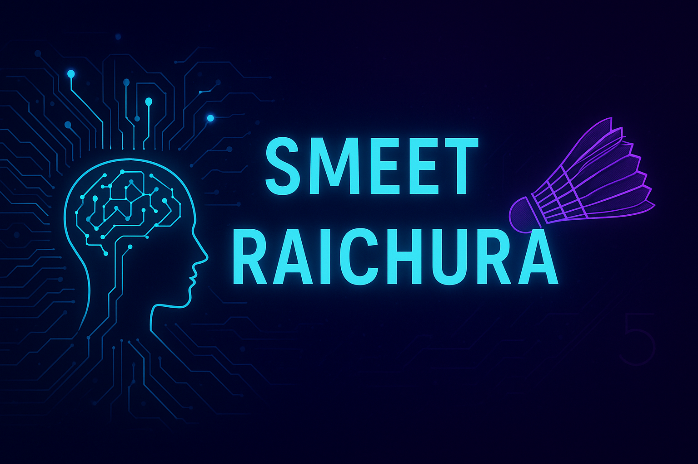

  

<h1 align="center">Hey there 👋, I'm Smeet Raichura</h1>
<h3 align="center">2nd-Year Student @ DARSHAN UNIVERSITY | AI/ML Aspirant | Professional Badminton Player</h3>

  

---

### 🚀 About Me
- 🎓 Currently pursuing **B.Tech in Computer Engineering** at **Darshan University**  
- 🤖 Passionate about **Artificial Intelligence & Machine Learning**  
- 🏸 Professional **Badminton Player** & tech enthusiast  
- 📚 Currently learning **Probability, Statistics, and Machine Learning Fundamentals**  
- 🎯 Goal: Become an **AI Engineer** with top-tier expertise  

---

### 🛠 Tech Stack

---

### 📌 Projects Showcase
Here are some projects I’m working on / planning to work on:
- 🧠 **Heart Disease Prediction (ML)** – Data-driven healthcare solution using Python & Pandas  
- 📈 **Stock Price Predictor** – Predictive modeling using Machine Learning  
- 📊 **Data Analysis Notebooks** – Exploratory data analysis on real-world datasets  

*(More coming soon... stay tuned!)*

---

### 📊 GitHub Stats

  
  

---

### 🌐 Connect with Me

  
  

---

💡 *“Code, Learn, and Smash — both in AI & on the Badminton court!”*

