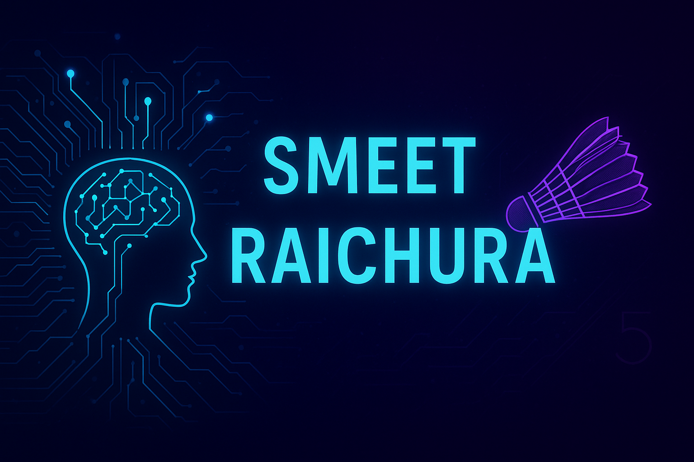

# Hi, I'm Smeet Raichura

  

  <strong>Computer Engineering Student</strong> at Darshan University 
  Building a strong foundation in <strong>AI, Machine Learning, Data Analysis, and Software Development</strong>

  
  

## About Me

- B.Tech student in Computer Engineering at Darshan University
- Focused on Artificial Intelligence, Machine Learning, and data-driven problem solving
- Currently learning probability, statistics, Python workflows, and ML fundamentals
- Interested in building practical projects that improve real-world decision making
- Working toward becoming an AI Engineer with strong software and analytical skills

## Tech Stack

  
  
  
  
  
  
  
  

## Current Focus

- Strengthening core Machine Learning concepts
- Building projects in prediction, analytics, and applied AI
- Improving problem-solving and development consistency
- Growing a portfolio of practical, well-documented work

## Featured Project Areas

- Heart Disease Prediction using machine learning and structured healthcare data
- Stock Price Prediction experiments using data analysis and predictive modeling
- Data Analysis notebooks focused on extracting insights from real-world datasets

## GitHub Analytics

  
  

  

## Connect

  
  

---

  <em>Open to learning, collaboration, and opportunities in AI, ML, and software development.</em>

